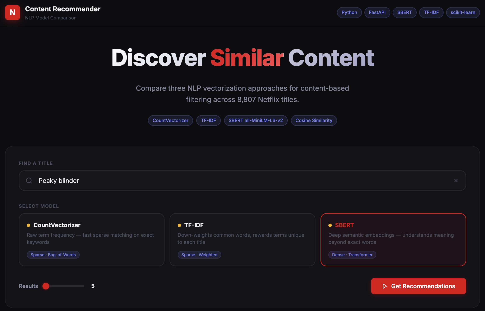

# 🎬 Netflix Content Recommender
### *Which NLP model actually understands what you want to watch?*

<p align="center">
  
  
  
  
</p>

<p align="center">
  <b>8,807 Netflix titles. 3 NLP models. 1 winner.</b><br/>
  An interactive deep-dive into how CountVectorizer, TF-IDF, and SBERT handle content-based recommendations — side by side, in real time.
</p>

<p align="center">
  
</p>

---

## The Idea

You search *"Peaky Blinders"* and want something with the same gritty, crime-drama energy. But does a model that counts raw word frequencies actually get that? What about one that weighs rare words more? Or a transformer that *reads between the lines?*

This app lets you find out — instantly, visually, and with hard numbers.

---

## What Makes It Interesting

| | CountVectorizer | TF-IDF | SBERT |
|---|---|---|---|
| **Approach** | Bag of words | Weighted frequency | Semantic embeddings |
| **Build Time** | ~0.4s | ~0.5s | ~10s |
| **Avg Cosine Similarity** | 0.058 | 0.021 | **0.219** |
| **Gets meaning?** | No | No | **Yes** |

> SBERT's higher similarity isn't noise — it's signal. The transformer actually understands that "gangster drama set in post-war England" and "crime thriller" mean something similar.

---

## Features

- **Live autocomplete** across all 8,807 titles
- **Real-time model status** — watch CountVectorizer and TF-IDF snap online in < 1s, then SBERT spin up
- **Switch models mid-search** — same title, completely different results
- **Rich result cards** — similarity score bar, genre tags, cast, director, rating, description
- **Performance panel** — build time, vocabulary size, and avg similarity for each model
- **Zero dependencies on the frontend** — pure HTML, CSS, and JS

---

## Quickstart

```bash
git clone https://github.com/briantong02/Netflix_Recommendation-.git
cd Netflix_Recommendation-
pip install -r requirements.txt
uvicorn app:app --reload
```

Open **http://localhost:8000** — CountVectorizer and TF-IDF are ready almost instantly. SBERT downloads ~90 MB of model weights on first run and is ready in ~10 seconds. The UI shows live loading status so you always know what's ready.

---

## How It Works

Every title's metadata is fused into a single text `soup`:

```
soup = title + director + cast + genres + description
```

Then each model vectorizes that soup differently:

**CountVectorizer** — raw word counts. Fast, interpretable, no understanding of importance.

**TF-IDF** — penalises common words, rewards rare ones. More discriminative, still purely lexical.

**SBERT (`all-MiniLM-L6-v2`)** — encodes each soup into a 384-dimensional dense vector using a fine-tuned transformer. Captures *meaning*, not just word overlap. Synonyms, themes, tone — it gets all of it.

All three rank results using **cosine similarity**.

---

## API

```bash
# Get recommendations
curl "http://localhost:8000/api/recommend?title=Peaky+Blinders&model=sbert&top_n=5"

# Check which models are loaded
curl "http://localhost:8000/api/status"

# Get performance metrics
curl "http://localhost:8000/api/metrics"
```

| Endpoint | Description |
|---|---|
| `GET /api/recommend` | Recommendations for a title (`model`: `count`/`tfidf`/`sbert`, `top_n`: 1–20) |
| `GET /api/status` | Loading state of each model |
| `GET /api/titles` | All 8,807 titles (for autocomplete) |
| `GET /api/metrics` | Build time, vocab size, avg similarity per model |

---

## Dataset

[Netflix Movies and TV Shows](https://www.kaggle.com/datasets/shivamb/netflix-shows) via Kaggle — 8,807 titles (6,131 movies + 2,676 TV shows).

---

## Stack

`Python` · `FastAPI` · `scikit-learn` · `sentence-transformers` · `pandas` · `numpy` · `Vanilla JS`

---

## Research Notebook

`nlp_a3_Wed(Evening)Group17.ipynb` contains the full analysis: model benchmarks, cosine similarity distribution histograms, qualitative output comparisons, and a breakdown of why SBERT's higher average similarity reflects semantic density rather than overfitting.

---

<p align="center">Built for NLP coursework · Group 17 · Wed Evening</p>
